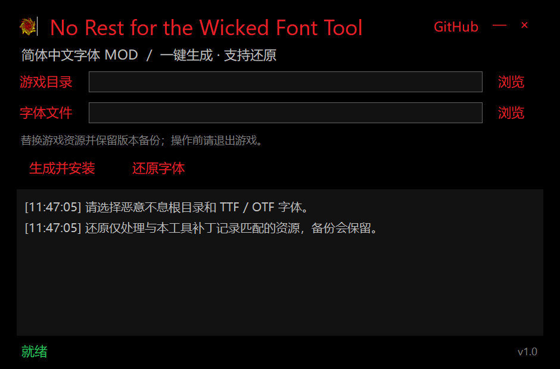
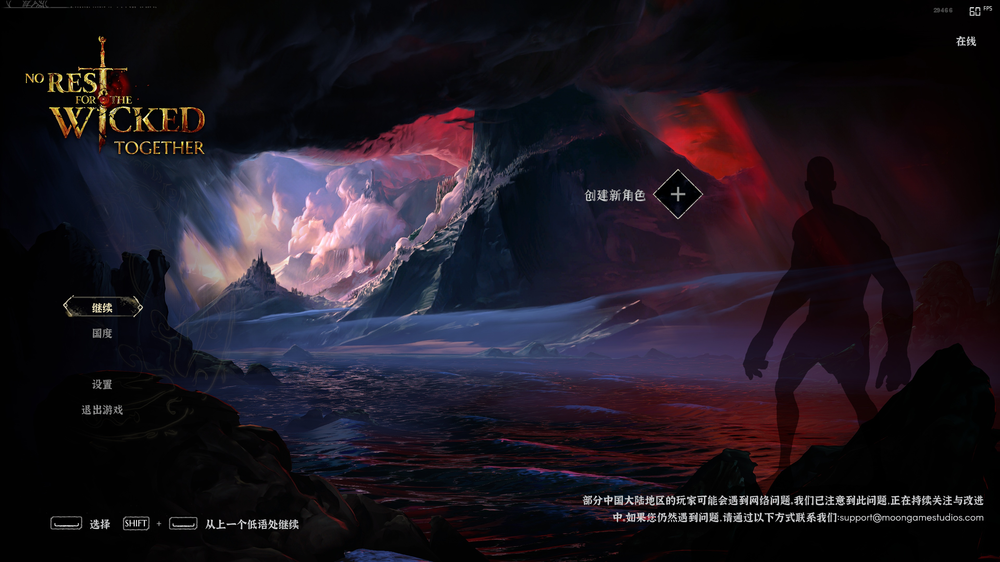

# No Rest for the Wicked Font Tool

[简体中文](#简体中文) | [繁體中文](#繁體中文)



游戏内效果（简体中文 + 自定义字体） / 遊戲內效果（簡體中文 + 自訂字體）：



## 简体中文

《恶意不息》Windows 版中文字体替换工具。选择游戏根目录和 `.ttf` / `.otf` 字体文件，即可一键安装或还原；发布包自带 .NET 运行时，无需 Python、Unity 编辑器或额外依赖。支持按语言替换：简体中文、繁體中文，可多选。界面与日志提供简体 / 繁體双语，可一键切换并记住选择。

### 使用方法

1. 从 [Releases](https://github.com/jakeouyang/NoRestForTheWickedFontTool/releases) 下载并解压最新版。
2. 退出游戏，运行 `WickedFontTool.exe`。
3. 选择包含 `NoRestForTheWicked.exe` 的游戏目录，以及要使用的字体文件。
4. 在“替换语言”中勾选要替换的游戏语言（可多选，默认全选），点击“生成并安装”。需要恢复时，点击“还原字体”。
5. 点击右上角“繁體 / 简体”可切换界面语言；游戏目录、字体路径、界面语言与语言选择会自动保存。

工具会校验游戏目录与字体文件。字体也可以拖进字体输入框。若游戏目录无写入权限，请按日志提示以管理员身份重新运行。

### 游戏更新与安全性

- 扫描 `Data` 目录以及 `StreamingAssets` 内实际为 UnityFS 的资源包，不依赖资源包的文件名或扩展名。因此游戏更新后资源包改名时通常仍可重新定位。
- 按所选语言识别序列化 Font 对象：简体中文 / 繁體中文对应 NotoSerifCJK SC / TC 的 Regular / Bold，兼容它们分散在不同资源文件中的情况。日文 / 韩文字体与表情、终端字体不会被改动。
- 游戏的英文文本由 TextMeshPro 渲染，其静态烘焙的 TMP 字体资产不随 TTF 字节变化，因此暂不支持英文替换；英文 UI 文本保持原版外观，简繁中文替换不受影响。重打包始终保持资源容器原有的存储方式，未压缩容器不会被改为压缩。
- 找不到完整目标、遇到无法解析的资源，或资源结构不兼容时会停止安装并保存 `scan.json` 诊断，而不是写入不完整的字体替换。
- 修改前保存以 SHA-256 标识的原始备份；写入采用事务处理，完成后校验目标字体与所有非目标资源。中断后下次运行会尝试恢复未完成事务。
- “还原字体”只接受仍与本工具补丁摘要完全一致的文件，不会用旧备份覆盖游戏更新或其他 Mod 的改动。

备份、运行记录与诊断文件保存在游戏根目录 `.WickedFontTool` 下。请保留该目录，直到不再需要还原功能。

> 新字体需要覆盖游戏实际使用的汉字。字体的字距、布局和最终游戏显示效果仍应在游戏内确认。

### 已知限制

工具针对当前可识别的 Unity 资源结构实现。未来游戏版本若改用新的字体族、静态图集、加密资源或不兼容的序列化格式，可能需要更新工具才能适配。英文 UI 文本依赖静态烘焙的 TextMeshPro 图集，暂不在替换范围内。

## 繁體中文

《惡意不息》Windows 版中文字體替換工具。選擇遊戲根目錄和 `.ttf` / `.otf` 字體檔案，即可一鍵安裝或還原；發行包自帶 .NET 執行時，無需 Python、Unity 編輯器或額外依賴。支援按語言替換：簡體中文、繁體中文，可多選。介面與日誌提供簡體 / 繁體雙語，可一鍵切換並記住選擇。

### 使用方法

1. 從 [Releases](https://github.com/jakeouyang/NoRestForTheWickedFontTool/releases) 下載並解壓縮最新版。
2. 結束遊戲，執行 `WickedFontTool.exe`。
3. 選擇包含 `NoRestForTheWicked.exe` 的遊戲目錄，以及要使用的字體檔案。
4. 在「替換語言」中勾選要替換的遊戲語言（可多選，預設全選），點擊「生成並安裝」。需要恢復時，點擊「還原字體」。
5. 點擊右上角「繁體 / 简体」可切換介面語言；遊戲目錄、字體路徑、介面語言與語言選擇會自動保存。

工具會校驗遊戲目錄與字體檔案。字體也可以拖進字體輸入框。若遊戲目錄無寫入權限，請按日誌提示以系統管理員身份重新執行。

### 遊戲更新與安全性

- 掃描 `Data` 目錄以及 `StreamingAssets` 內實際為 UnityFS 的資源包，不依賴資源包的檔案名稱或副檔名。因此遊戲更新後資源包改名時通常仍可重新定位。
- 按所選語言識別序列化 Font 物件：簡體中文 / 繁體中文對應 NotoSerifCJK SC / TC 的 Regular / Bold，相容它們分散在不同資源檔案中的情況。日文 / 韓文字體與表情、終端機字體不會被改動。
- 遊戲的英文文本由 TextMeshPro 渲染，其靜態烘焙的 TMP 字體資產不隨 TTF 位元組變化，因此暫不支援英文替換；英文 UI 文本保持原版外觀，簡繁中文替換不受影響。重新打包始終保持資源容器原有的儲存方式，未壓縮容器不會被改為壓縮。
- 找不到完整目標、遇到無法解析的資源，或資源結構不相容時會停止安裝並保存 `scan.json` 診斷，而不是寫入不完整的字體替換。
- 修改前保存以 SHA-256 標識的原始備份；寫入採用交易處理，完成後校驗目標字體與所有非目標資源。中斷後下次執行會嘗試恢復未完成交易。
- 「還原字體」只接受仍與本工具補丁摘要完全一致的檔案，不會用舊備份覆蓋遊戲更新或其他 Mod 的改動。

備份、執行記錄與診斷檔案保存在遊戲根目錄 `.WickedFontTool` 下。請保留該目錄，直到不再需要還原功能。

> 新字體需要覆蓋遊戲實際使用的漢字。字體的字距、版面與最終遊戲顯示效果仍應在遊戲內確認。

### 已知限制

工具針對目前可識別的 Unity 資源結構實現。未來遊戲版本若改用新的字體族、靜態圖集、加密資源或不相容的序列化格式，可能需要更新工具才能適配。英文 UI 文本依賴靜態烘焙的 TextMeshPro 圖集，暫不在替換範圍內。

## Build from source

Clone with submodules, then build with the .NET 8 SDK:

```powershell
git clone --recurse-submodules https://github.com/jakeouyang/NoRestForTheWickedFontTool.git
cd NoRestForTheWickedFontTool
dotnet build WickedFontTool.csproj -c Release
```

The GitHub Actions release workflow publishes a self-contained `win-x64` package when a tag matching `v*` is pushed. See [THIRD-PARTY.md](THIRD-PARTY.md) for dependency and asset notices.
